# ¿Que es arduino?
Arduino es una plataforma de código abierto basada en hardware y software libre que facilita la creación de proyectos de electrónica y automatización.

Fernández, Y. (2025, junio 25). Qué es Arduino, cómo funciona y qué puedes hacer con uno. Xataka. Xataka.com. https://www.xataka.com/basics/que-arduino-como-funciona-que-puedes-hacer-uno

-----

# ¿Cómo se utiliza el programa Arduino IDE?

El programa Arduino IDEse utiliza para escribir, compilar y cargar código en las placas de desarrollo Arduino mediante una interfaz gráfica sencilla. 

Pasos básicos para utilizar Arduino IDE:

•	Instalación y conexión: Descarga e instala el programa desde la página oficial y conecta tu placa Arduino a la computadora con un cable USB. 

•	Selección de placa y puerto: Ve al menú Herramientas para elegir el modelo exacto de tu tarjeta (por ejemplo, Arduino Uno) y el puerto de comunicación al que está conectada.

•	Estructura del código (Sketch): Escribe tu programa utilizando las dos funciones principales:

•	setup(): Se ejecuta una sola vez al encender o reiniciar la placa para configurar los pines.

•	loop(): Se ejecuta de forma repetida e indefinida, controlando la lógica principal del circuito. 

•	Verificación y subida: Haz clic en el botón de verificar (icono de marca de verificación) para comprobar que no hay errores de sintaxis, y luego en el botón de subir (icono de flecha) para transferir el código a la memoria de la placa. 

Ar, B. [@BitwiseAr]. (s/f). Arduino desde cero en Español - Capítulo 2 - Primer programa e Instalación del IDE de Arduino [[Object Object]]. Youtube. Recuperado el 3 de septiembre de 2026, de https://www.youtube.com/watch?v=GUuWgk3dXd0

# Materiales 

**Arduino UNO**

Microcontrolador que permite programar y controlar los componentes electrónicos conectados a sus pines digitales y analógicos.

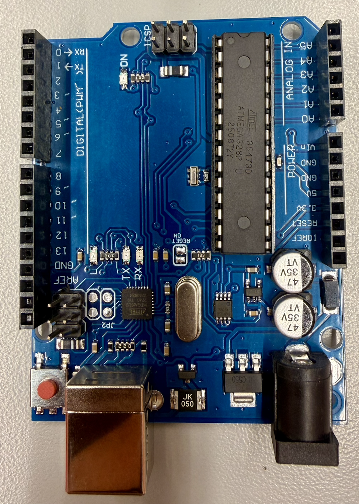

**Cable USB**

Sirve para conectar el Arduino a la computadora, permitiendo cargar programas y proporcionar alimentación eléctrica.

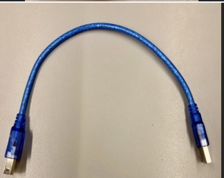

**Protoboard**

Permite montar circuitos electrónicos sin necesidad de soldar, conectando fácilmente los diferentes componentes

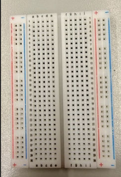

**LED**

Diodo emisor de luz que se enciende cuando recibe corriente eléctrica en la dirección correcta.

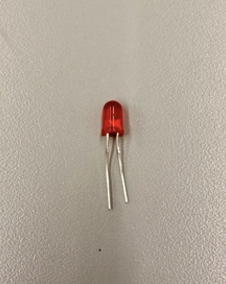

**Resistencia Eléctrica**

Limita la cantidad de corriente que circula por el circuito y ayuda a proteger componentes como los LED.

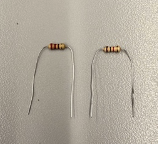

**Cables Jumper**

Se utilizan para realizar las conexiones eléctricas entre los diferentes componentes del circuito.

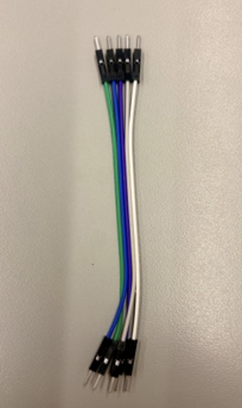

**Display de 7 segmentos**

Dispositivo formado por siete segmentos luminosos que permite representar números y algunos caracteres.

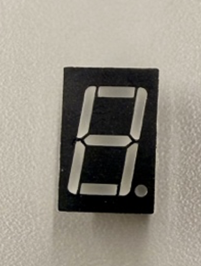

**Botón pulsador (push button)**

Es un interruptor momentáneo que permite abrir o cerrar el circuito al presionarlo. Se utiliza como entrada digital para que Arduino detecte cuándo se pulsa.

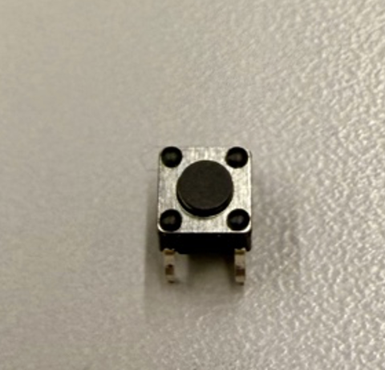

**Servomotor (servo)**

Motor azul pequeño (tipo SG90) con engranajes y un eje que puede girar a posiciones controladas (normalmente 0°–180°). Se controla con una señal PWM desde el Arduino.

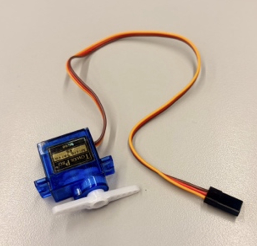

**Potenciómetro**

Resistencia variable circular con un eje/perilla que se puede girar. Se usa para enviar una señal analógica al Arduino y controlar la posición del servo.

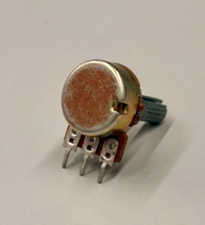

**Fuente de alimentación externa**

Módulo o fuente gris (visible en el circuito “21_Fuente Externa”) que suministra energía adicional (normalmente 5 V o 6 V) al servo, para no sobrecargar el Arduino cuando se usan varios servos.

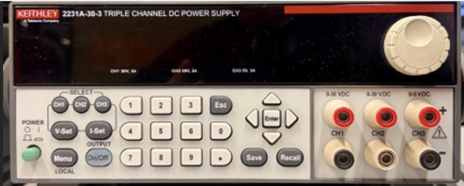

**Cables de prueba (o leads de conexión) con pinzas de cocodrilo y conectores banana.**

Par de cables (rojo y negro) que tienen en un extremo pinzas de cocodrilo (para agarrar terminales, pilas, o componentes) y en el otro extremo conectores tipo banana (macho). Se usan para conectar fuentes de alimentación, baterías o equipos de medición a un circuito de forma rápida y temporal.

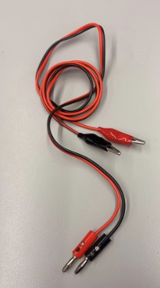

-------

# Circuitos

# Circuito 0

**Imagen Tinkerkad**
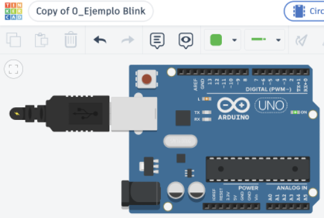
**Foto**

**VIDEO**

**Código**

